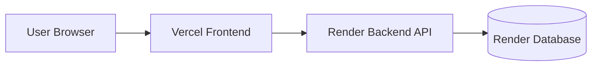
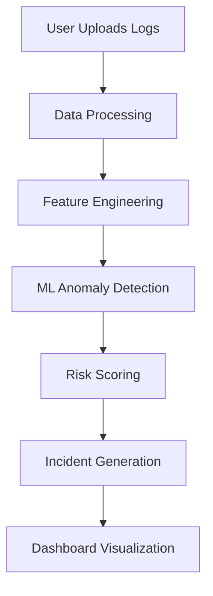

# ☁️ Cloud Anomaly Detection System

### AI-Powered Cloud Monitoring & Threat Detection Platform

*A full-stack intelligent monitoring solution that analyzes cloud infrastructure logs, detects anomalies using machine learning, and transforms raw telemetry into actionable security insights.*

> Detect. Analyze. Protect.


---

## 🚀 Live Deployment

### Production URLs

> Live demo: https://cloud-anomaly-detection-system.vercel.app

### Deployment Architecture



---

## 🔭 Overview

Cloud Anomaly Detection System is built for modern cloud security operations. It ingests authentication, API, and system logs, applies machine learning-based anomaly detection, correlates signals across sources, and surfaces a unified risk score with incident-level context.

This project is designed to feel like a production SaaS product:

- Secure, authenticated access
- Dashboard-first operational visibility
- Explainable incident outputs
- Persistent history and auditability
- Clean UI for security teams and reviewers

---

## 🚀 Why This Project?

Cloud environments generate high-volume telemetry that is difficult to triage manually. Important anomalies often hide inside normal operational noise, leading to:

- Massive cloud log volumes
- Hidden anomalies across multiple sources
- Delayed incident response
- Increased operational and security risk

This platform addresses that gap by automating detection, correlation, and risk interpretation in one workflow.

---

## ✨ Platform Highlights

| Category | What It Delivers |
|---|---|
| 🔐 Authentication & Security | User registration, login, JWT authentication, protected routes, and token-based API access |
| 📊 Monitoring & Analytics | Dashboard metrics, anomaly summaries, trend views, and risk visibility |
| 🧠 Machine Learning Engine | Isolation Forest and Local Outlier Factor models for cloud log anomaly detection |
| 🚨 Incident Management | Incident generation, severity scoring, and detailed incident inspection |
| 🎨 User Experience | Responsive interface, dark/light theme support, and intuitive analysis workflow |

---

## 🧠 Intelligence Layer

The platform combines multiple anomaly detection approaches:

- Isolation Forest
- Local Outlier Factor (LOF)

These models help identify suspicious activity patterns, abnormal resource behavior, and potential operational risks across authentication, API, and system telemetry.

The backend then correlates source-level anomalies into a single risk score and severity level:

- `LOW`
- `MEDIUM`
- `HIGH`
- `CRITICAL`

---

## 🧩 Architecture Overview



### System Flow

1. User uploads log files
2. Backend validates and stores the data
3. ML models analyze each telemetry source
4. Correlation engine calculates the combined risk score
5. Incident records are created and persisted
6. Dashboard, history, and incident pages render the results

---

## ✨ Feature Matrix

| Area | Capability | Impact |
|---|---|---|
| Authentication & Security | JWT login, registration, protected routes | Keeps sensitive analysis views and APIs secure |
| Monitoring & Analytics | Dashboard metrics and anomaly summaries | Gives fast operational visibility into risk posture |
| Machine Learning | Isolation Forest + LOF anomaly detection | Identifies unusual patterns without manual rule writing |
| Incident Management | Incident records and detail pages | Turns raw model output into actionable security findings |
| User Experience | Responsive UI, theme support, clean navigation | Makes the platform feel like a modern SaaS product |

---

## 🛠️ Tech Stack

### Frontend

- React
- Vite
- React Router
- Axios

### Backend

- Python
- Flask
- Flask-JWT-Extended
- Flask-SQLAlchemy
- Flask-Migrate

### Database

- SQLite for local development
- Render managed database for production

### Machine Learning

- Isolation Forest
- Local Outlier Factor
- Scikit-learn
- Pandas
- NumPy

---

## 📁 Project Structure

```text
cloud_anomaly_detection_system/
├── backend/
│   ├── app.py
│   ├── config.py
│   ├── routes/
│   ├── services/
│   ├── models/
│   ├── migrations/
│   └── tests/
├── frontend/
│   ├── src/
│   ├── public/
│   ├── index.html
│   ├── vite.config.js
│   └── package.json
├── models/
│   ├── API/
│   ├── auth/
│   └── system/
├── results/
├── requirements.txt
├── Procfile
└── README.md
```

---

## ⚙️ Installation

### Prerequisites

- Python 3.11+
- Node.js 18+
- npm 9+

### Clone the repository

```bash
git clone <your-repository-url>
cd cloud_anomaly_detection_system
```
---

## 🖥️ Backend Setup

### Windows PowerShell

```powershell
cd backend
python -m venv .venv
.\.venv\Scripts\Activate.ps1

pip install -r ..\requirements.txt

$env:FLASK_APP="app.py"
$env:FLASK_ENV="development"

flask db upgrade
python app.py
```

### Linux / macOS

```bash
cd backend
python3 -m venv .venv
source .venv/bin/activate

pip install -r ../requirements.txt

export FLASK_APP=app.py
export FLASK_ENV=development

flask db upgrade
python app.py
```

---

## 🎨 Frontend Setup

```bash
cd frontend
npm install
npm run dev
```

---

## 🔐 Environment Variables

### Backend

Create a `.env` file in `backend/`:

```env
SECRET_KEY=your-secret-key
JWT_SECRET_KEY=your-jwt-secret-key
DATABASE_URL=sqlite:///dev.db
CORS_ORIGINS=http://localhost:5173,http://127.0.0.1:5173
```

### Frontend

Create a `.env` file in `frontend/`:

```env
VITE_API_URL=http://127.0.0.1:5000
```

---

## 🗄️ Database Setup

SQLite is used for local development. The database is created automatically when the backend starts and migrations are applied.

```bash
cd backend
flask db upgrade
```

For production, the application connects to the Render-managed database through `DATABASE_URL`.

---

## ▶️ Running the Application

### Local Development

Backend:

```bash
cd backend
source .venv/bin/activate
python app.py
```

Frontend:

```bash
cd frontend
npm run dev
```

### Production-Style Start

```bash
gunicorn --chdir backend --bind 0.0.0.0:$PORT app:app
```

---

## 🔎 API Overview

All protected endpoints require a valid JWT access token in the `Authorization: Bearer <token>` header.

### Authentication

- `POST /auth/register` - Register a new user
- `POST /auth/login` - Log in and receive JWT tokens
- `POST /auth/logout` - Revoke the active token
- `POST /auth/refresh` - Refresh the access token
- `GET /auth/profile` - Fetch current user profile

### Analysis

- `POST /analyze` - Upload logs and run anomaly detection

### Dashboard and History

- `GET /dashboard` - Dashboard summary metrics
- `GET /dashboard/trends` - Risk score trend data
- `GET /history` - List all analysis runs
- `GET /history/<run_id>` - Fetch a single run
- `GET /incidents` - List incident summaries

### Health

- `GET /` - API root message

---

## 🧪 Machine Learning Models Used

### 🧠 Intelligence Layer

The platform combines multiple anomaly detection approaches:

- Isolation Forest
- Local Outlier Factor (LOF)

to identify suspicious activity patterns, abnormal resource behavior, and potential operational risks.

### Scoring Pipeline

- Source-level anomaly detection
- Correlation across auth, API, and system telemetry
- Weighted risk scoring
- Severity classification into four levels

---

## 🚀 Production Deployment

### Frontend Deployment (Vercel)

- Automatic deployment from GitHub
- Optimized React/Vite production build
- Environment variable configuration

### Backend Deployment (Render)

- Flask API hosted on Render
- Production environment variables
- Scalable deployment configuration

### Database Deployment (Render)

- Persistent cloud database
- Secure backend connectivity
- Production-ready data storage

---

## 📸 Screenshots

### Landing Page


### Dashboard


### Run Analysis


### History and Incidents


---

## 🔮 Future Enhancements

- Real-time streaming log ingestion
- Alerting and notification integrations
- Advanced model explainability
- Multi-tenant organization support
- Exportable security reports
- Expanded anomaly explanation insights

---

## 👥 Contributors

- Rupsha Debnath
- Soumi Saha
- Soumili Saha
- Srijeeta Dutta

---

## 📄 License

This project is currently provided without an explicit license. Add one before public distribution if needed.
